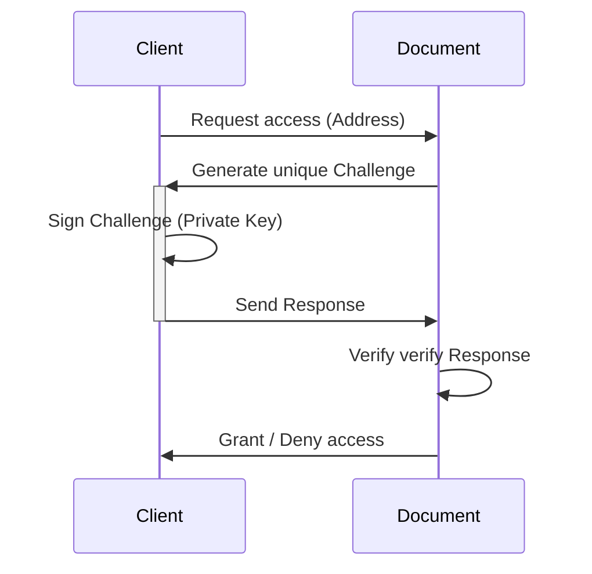

# Decentralized Document Access Protocol (DDAP)

Decentralized Document Access Protocol (DDAP) is a protocol that allows secure and decentralized access to document over a network using cryptographic signatures. This protocol relies on a client-server architecture where the document verifies requests from clients. Clients need to provide valid signatures to prove their identity and gain access to authorized document.

## Document Authorization Protocol

The document authorization protocol is based on the idea that clients prove their identity by signing a unique challenge generated by the server. The server can then verify the signature using the client's public key. The server only grants access to documents if the client's address (derived from their public key) is in the list of allowed addresses and the signature is valid.

## Key Components

1. **Public and Private Key Pair**: Clients generate a key pair (public and private key) which is used for signing and verifying messages. The public key is shared with the server and used to derive the address.
2. **Address**: Each client has a unique address derived from their public key. The server stores a list of allowed addresses to grant access to documents. The address is the sha256 hash of the public key.
3. **Base58 Encoding**: The address is encoded using base58 encoding to make it shorter and more human-readable than Base64 encoding.
3. **Challenge**: A unique randomly generated message that the server sends to the client to sign with their private key. The challenge-response mechanism is used to prevent replay attacks.

## Protocol Flow

Here's an overview of the main flow of the document authorization protocol.

1. **Request Access**: The client requests access to a document by sending their address (derived from their public key) to the document owner (server).
2. **Generate Unique Challenge**: The server generates a unique challenge (random message) for the client's address. This challenge will be used to verify the client's identity.
3. **Sign Challenge**: The client signs the challenge using their private key. This signed challenge acts as a proof of the client's identity.
4. **Send Response**: The client sends the signed challenge and their public key back to the server as a response.
5. **Verify Response**: The server verifies the response by checking if the client's address is in the list of allowed addresses and if the signature matches the challenge using the client's public key.
6. **Grant or Deny Access**: Based on the verification result, the server either grants or denies access to the requested document. If the verification is successful, the server grants access, otherwise, access is denied.

This protocol ensures that only authorized clients can access the document, and it provides a secure and decentralized mechanism for document access control. The use of unique challenges for each request also prevents replay attacks, further enhancing the security of the protocol.
