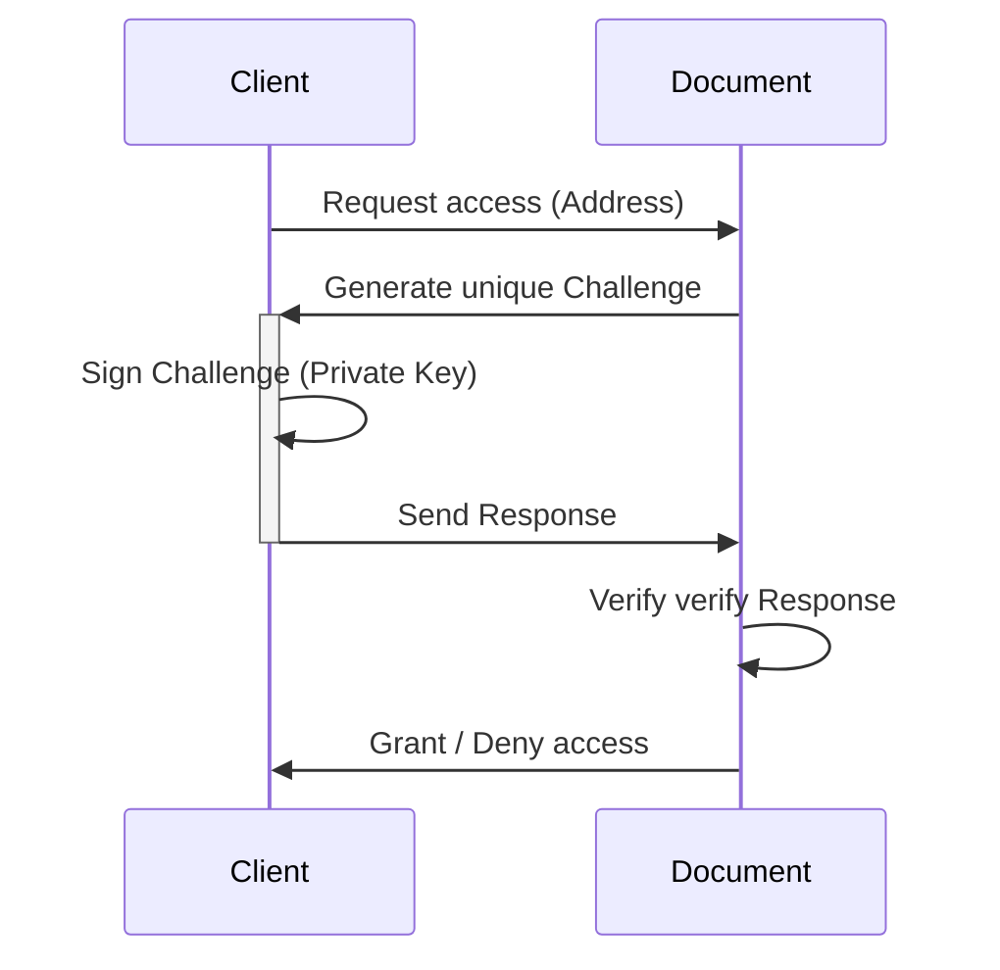

# Decentralized Document Access Protocol (DDAP)

Decentralized Document Access Protocol (DDAP) is a protocol that allows secure and decentralized access to document over a network using cryptographic signatures. This protocol relies on a client-server architecture where the document verifies requests from clients. Clients need to provide valid signatures to prove their identity and gain access to authorized document.

## Document Authorization Protocol

The document authorization protocol is based on the idea that clients prove their identity by signing a unique challenge generated by the server. The server can then verify the signature using the client's public key. The server only grants access to documents if the client's address (derived from their public key) is in the list of allowed addresses and the signature is valid.

## Key Components

1. **Public and Private Key Pair**: Clients generate a key pair (public and private key) which is used for signing and verifying messages. The public key is shared with the server and used to derive the address.
2. **Address**: Each client has a unique address derived from their public key. The server stores a list of allowed addresses to grant access to documents. The address is the sha256 hash of the public key.
3. **Base58 Encoding**: The address is encoded using base58 encoding to make it shorter and more human-readable than Base64 encoding.
3. **Challenge**: A unique randomly generated message that the server sends to the client to sign with their private key. The challenge-response mechanism is used to prevent replay attacks.

## Protocol Flow

Here's an overview of the main flow of the document authorization protocol.

1. **Request Access**: The client requests access to a document by sending their address (derived from their public key) to the document owner (server).
2. **Generate Unique Challenge**: The server generates a unique challenge (random message) for the client's address. This challenge will be used to verify the client's identity.
3. **Sign Challenge**: The client signs the challenge using their private key. This signed challenge acts as a proof of the client's identity.
4. **Send Response**: The client sends the signed challenge and their public key back to the server as a response.
5. **Verify Response**: The server verifies the response by checking if the client's address is in the list of allowed addresses and if the signature matches the challenge using the client's public key.
6. **Grant or Deny Access**: Based on the verification result, the server either grants or denies access to the requested document. If the verification is successful, the server grants access, otherwise, access is denied.

This protocol ensures that only authorized clients can access the document, and it provides a secure and decentralized mechanism for document access control. The use of unique challenges for each request also prevents replay attacks, further enhancing the security of the protocol.

## Cryptography Details in Decentralized Document Access Protocol (DDAP)

The Decentralized Document Access Protocol (DDAP) relies heavily on cryptographic techniques to ensure secure and decentralized access to documents. In this section, we provide an overview of the main cryptographic components and algorithms used in the protocol and provide examples of their results.

### Key Generation

Clients generate a key pair (public and private key) using the Elliptic Curve Digital Signature Algorithm (ECDSA). ECDSA is used for signing and verifying messages.

#### ECDSA

ECDSA is a public-key cryptography algorithm that offers strong security and is widely used in decentralized systems. It is based on elliptic curve cryptography, which enables smaller key sizes compared to RSA while maintaining the same level of security.

In DDAP, clients use ECDSA with the following parameters:
- Curve: P-256
- Hash Function: SHA-256

The P-256 curve provides a good balance between security and performance. It is widely supported in cryptographic libraries and hardware

### Address Generation

The client's address is the SHA-256 hash of their public key, which is then encoded using Base58 encoding.

#### SHA-256

SHA-256 is a secure hash algorithm that produces a fixed-size output (256 bits) from an input message. It is resistant to preimage and collision attacks, which means it is computationally infeasible to find two different messages with the same hash or to find the original message given its hash value.

By hashing the public key, we create a unique and fixed-size identifier (the address) that can be used for access control purposes.

#### Base58 Encoding

Base58 encoding is a variant of Base64 encoding that omits characters that could be visually confused with others. The main advantage of Base58 is that it results in shorter strings and is more human-readable compared to hexadecimal or Base64 encoding. Base58 is widely used in decentralized systems, such as Bitcoin addresses.

**Example**:

Here are different representations of the same address using different encodings:

| Format      | Representation                                                     |
|-------------|--------------------------------------------------------------------|
| Hexadecimal | `9f48ea65930bc9ec4c493f8855ec16b1eefb20daffd3c9f0cfa0378fd77fc862` |
| Base64      | `n0jqZZMLyexMST+IVewWse77INr/08nwz6A3j9d/yGI=`                     |
| Base58      | `BinK2ofop72pNrVuLcKW4jecJ2ZgwavmWndiAEmdy3pu`                     |

As you can see, Base58 encoding results in a shorter and more human-readable address compared to hexadecimal or Base64 encoding.

### Challenge-Response Mechanism

To prevent replay attacks, the protocol utilizes a challenge-response mechanism. The server generates a unique random challenge for each client request, which the client signs using their private key. Clients use ECDSA to sign the challenge, and the server verifies the signature using the client's public key. Access to the document is only granted if the signature is valid and the client's address is in the list of allowed addresses.

In summary, the DDAP protocol relies on modern and well-established cryptographic techniques to ensure secure and decentralized access to documents. The use of ECDSA for key generation, signing, and verification provides strong security while maintaining good performance. Address generation using SHA-256 and Base58 encoding ensures unique and human-readable identifiers for access control. Lastly, the challenge-response mechanism based on ECDSA signatures prevents replay attacks and enhances the overall security of the protocol.
