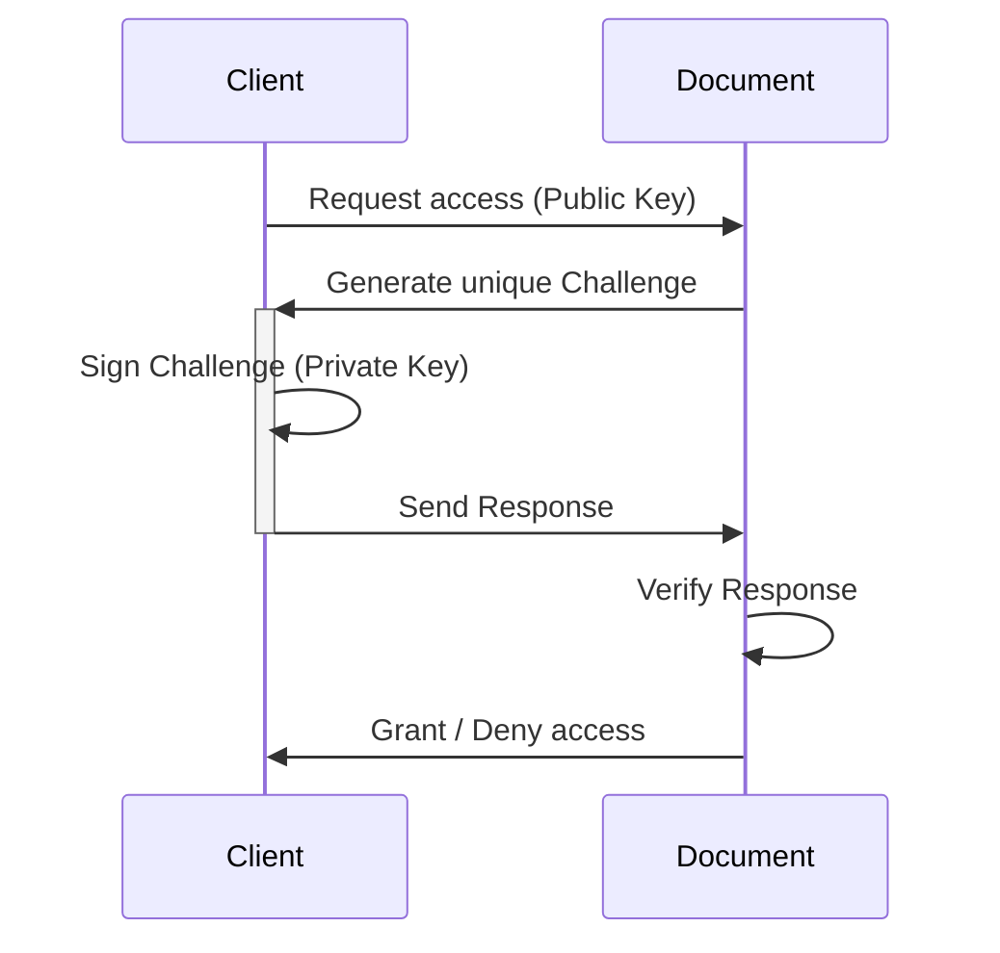

# Decentralized Document Access Protocol (DDAP)

Decentralized Document Access Protocol (DDAP) is a protocol that allows secure and decentralized access to a document over a network using cryptographic signatures. This protocol relies on a client-server architecture where the document verifies requests from clients. Clients need to provide valid signatures to prove their identity and gain access to the authorized document.

## Document Authorization Protocol

The document authorization protocol is based on the idea that clients prove their identity by signing a unique challenge generated by the server. The server can then verify the signature using the client's public key. The server only grants access to documents if the signature is valid.

## Key Components

1. **Public and Private Key Pair**: Clients generate a key pair (public and private key) using the secp256k1 elliptic curve algorithm, which is used for signing and verifying messages. The public key is shared with the server.
2. **Base58 Encoding**: The public key is encoded using base58 encoding to make it shorter and more human-readable than Base64 encoding.
3. **Challenge**: A unique randomly generated message that the server sends to the client to sign with their private key. The challenge-response mechanism is used to prevent replay attacks.

## Protocol Flow

Here's an overview of the main flow of the document authorization protocol.

1. **Request Access**: The client requests access to a document by sending their compressed public key to the document owner (server).
2. **Generate Unique Challenge**: The server generates a unique challenge (random message) for the client. This challenge will be used to verify the client's identity.
3. **Sign Challenge**: The client signs the challenge using their private key. This signed challenge acts as proof of the client's identity.
4. **Send Response**: The client sends the signed challenge back to the server as a response.
5. **Verify Response**: The server verifies the response by checking if the signature matches the challenge using the client's public key.
6. **Grant or Deny Access**: Based on the verification result, the server either grants or denies access to the requested document. If the verification is successful, the server grants access; otherwise, access is denied.

This protocol ensures that only clients with a valid signature can access the document, providing a secure and decentralized mechanism for document access control. The use of unique challenges for each request also prevents replay attacks, further enhancing the security of the protocol.

## Cryptography Details in Decentralized Document Access Protocol (DDAP)

The Decentralized Document Access Protocol (DDAP) relies heavily on cryptographic techniques to ensure secure and decentralized access to documents. In this section, we provide an overview of the main cryptographic components and algorithms used in the protocol and provide examples of their results.

### Key Generation

Clients generate a key pair (public and private key) using the secp256k1 elliptic curve algorithm. secp256k1 is used for signing and verifying messages.

#### secp256k1

secp256k1 is a public-key cryptography algorithm used extensively in decentralized systems, such as Bitcoin. It uses elliptic curve cryptography, which provides strong security with smaller key sizes compared to other algorithms like RSA, making it more efficient.

The secp256k1 algorithm generates a compressed public key, which is shared with the server during the access request. This compressed public key provides the same level of security but uses less data, making it more suitable for decentralized systems.

### Base58 Encoding

The public key is encoded using base58 encoding to make it shorter and more human-readable than Base64 encoding. Base58 is widely used in decentralized systems, such as Bitcoin addresses.

### Challenge-Response Mechanism

To prevent replay attacks, the protocol utilizes a challenge-response mechanism. The server generates a unique random challenge for each client request, which the client signs using their private key. Clients use secp256k1 to sign the challenge, and the server verifies the signature using the client's public key. Access to the document is only granted if the signature is valid.

In summary, the DDAP protocol relies on modern and well-established cryptographic techniques to ensure secure and decentralized access to documents. The use of secp256k1 for key generation, signing, and verification provides strong security while maintaining good performance. Base58 encoding ensures unique and human-readable identifiers for access control. Lastly, the challenge-response mechanism based on secp256k1 signatures prevents replay attacks and enhances the overall security of the protocol.
