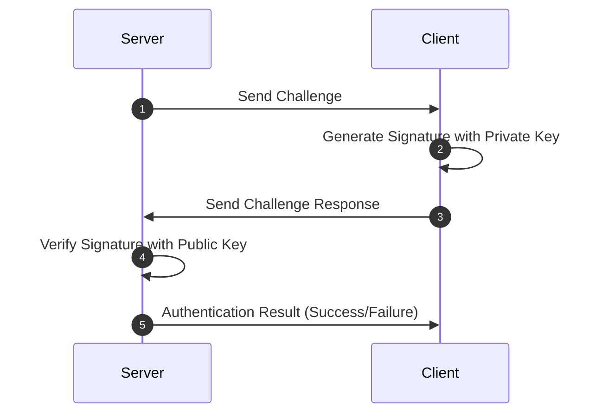
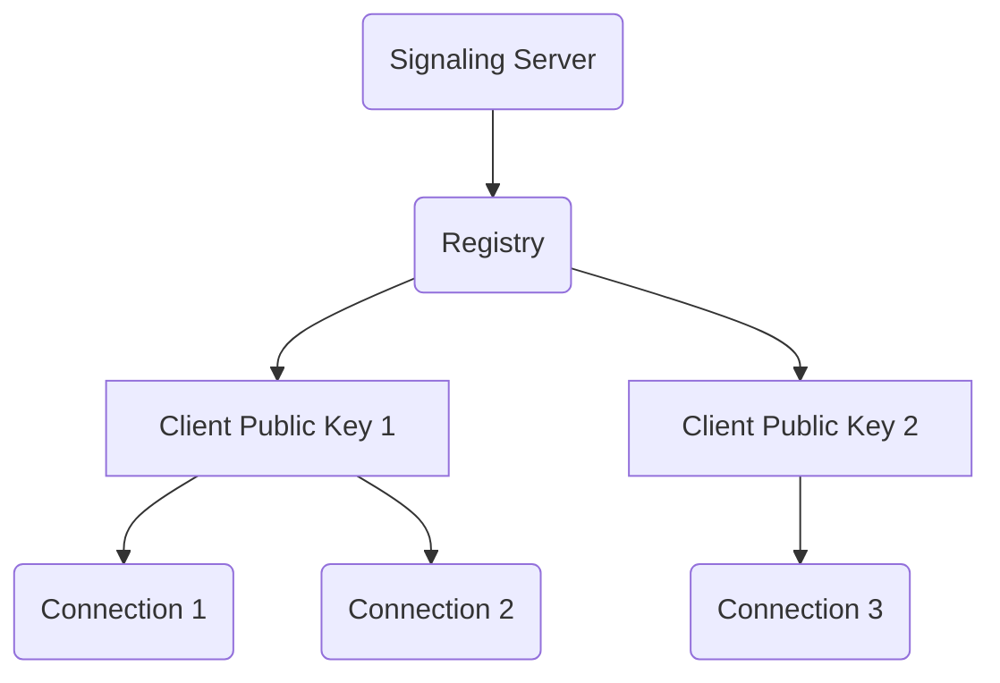
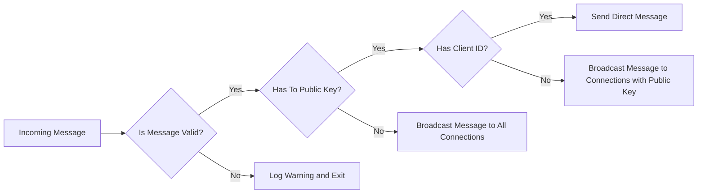
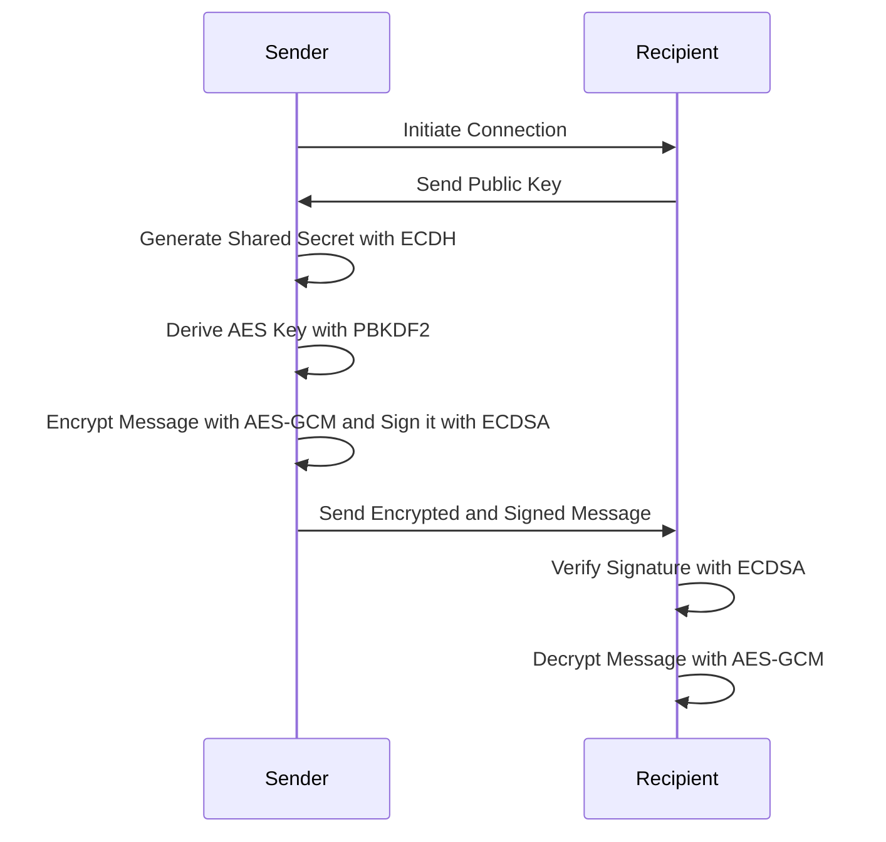

# Signaling Server

A signaling server is a server that helps peers set up a peer-to-peer connection. 
It is used to exchange network information between peers and establish a direct connection between them. 
The signaling server is not involved in the data transmission between peers. 
It is only used to establish a connection between peers. 
Once the connection is established, the signaling server is no longer involved in the communication.

## Authenticator
The authenticator module has three distinct classes: the base Authenticator class, the ServerAuthenticator class, and the ClientAuthenticator class. These classes are designed to verify the authenticity of connections using a cryptographic challenge-response handshake mechanism.

### Challenge-Response Mechanism
The challenge-response mechanism is a method of proving identity by demonstrating knowledge of a secret without revealing it. Here, a random challenge is generated by the server and sent to the client. The client then generates a response to the challenge using its private key, which can be verified with the client's public key known to the server. This ensures the client's identity, as only the valid owner of the private key can generate a correct response.

The authentication process sequence is as follows:

1. Server sends a random challenge to the client.
2. Client receives the challenge and creates a response signature using its private key.
3. Client sends back the signed response to the server.
4. Server verifies the response using the client's public key.
5. If the verification is successful, the server acknowledges the client as authenticated. Otherwise, it closes the connection.

The sequence can be represented with this sequence diagram:


## Messages routing
The signaling server is responsible for routing messages between clients. To do this, it maintains a registry of clients and their connections. Each client can have multiple connections, and each connection is uniquely identified by a randomly generated client ID. This, along with the client's public key, allows us to send a message to all clients, to all connections of a specific client, or to a specific connection.


### Message Structure
```ts
type Message<TData> = {
  from: {
    publicKey: Uint8Array;  // sender's public key
    clientId: Uint8Array;   // sender's clientId
  };
  to?: {
    publicKey: Uint8Array;  // recipient's public key
    clientId?: Uint8Array;  // recipient's clientId (optional)
  };
  data: TData;              // payload data of the message
};
```
This message structure is designed with flexibility and security in mind:

- `from` field identifies the sender of the message.
- `to` field is optional and identifies the recipient of the message. This is necessary when the message is private and intended for a specific user. If the to field is omitted, the message is considered public and can be read by any user in the network
- `data` field contains the actual payload data of the message.

Messages in this system can be transmitted in three different ways depending on the target recipient:

- **Broadcast**: A message is broadcasted to all users in the network. This is the default transmission method when the `to` field is omitted.
- **Multicast**: A message is sent to a specific user in the network. This is the default transmission method when the `to` field is specified, but the `clientId` field is omitted.
- **Unicast**: A message is sent to a specific session of a user in the network. This is the default transmission method when the `to` field is specified and the `clientId` field is specified.

Here is a flowchart representing the routing logic:

This strategy ensures that the server can efficiently route messages to the correct recipients based on the information contained within the messages themselves. 
This is essential for maintaining robust and secure communication within the network.

### Message Encryption

The system automatically encrypts messages if the recipient's public key is specified.
The system implements a secure transmission protocol, which leverages cryptography to maintain the confidentiality and integrity of the messages. 
The specific cryptographic operations used include:

- **Elliptic Curve Diffie-Hellman (ECDH)**: A key exchange protocol which allows two parties to establish a shared secret over an insecure channel. This shared secret is generated using the sender's private key and the recipient's public key.

- **Password-Based Key Derivation Function 2 (PBKDF2)**: A key derivation function used to derive an AES key from the shared secret obtained from the ECDH exchange. It adds a salt for randomness, providing resistance against dictionary attacks.

- **Advanced Encryption Standard - Galois/Counter Mode (AES-GCM)**: This symmetric encryption algorithm uses the derived AES key to encrypt the message, ensuring that only the intended recipient can decrypt and read it. AES-GCM provides both data confidentiality and integrity.

- **Elliptic Curve Digital Signature Algorithm (ECDSA) with the secp256k1 curve**: After the message is encrypted, it is signed using the sender's private key. The signature helps verify the authenticity of the sender and confirms that the message has not been tampered with during transmission.

Here's a sequence diagram representing the steps:

This protocol ensures secure and confidential communication, where only intended recipients can decrypt and read the message. 
It also verifies the authenticity of the sender and ensures the integrity of the message.
