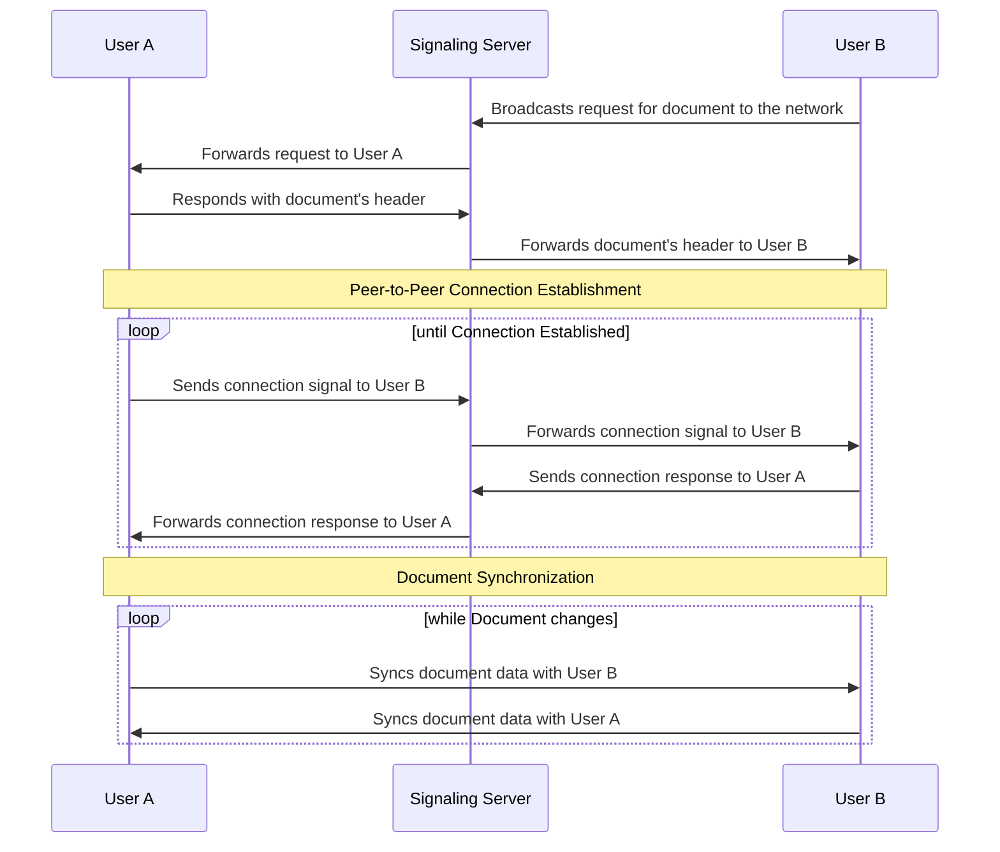

# Technical Overview

The DDnet network implements a unique blend of secure communication protocols and data structures,
ensuring user privacy and seamless data interactions.
Each user on the network is assigned a unique pair of public and private keys,
generated through the secp256k1 elliptic curve algorithm,
along with a clientId that uniquely identifies user sessions or instances on the network.

At the core of DDnet's structure lies the Document, divided into a Header and Data, each serving a distinct purpose.
The Header hosts essential metadata about the document, including the unique identifier,
ownership information, and the list of clients allowed to access the document.
On the other hand, the Data part of the Document is managed to use CRDTs,
with Automerge handling the data management internally.

The network also adopts CBOR (Concise Binary Object Representation)
as its data serialization format and establishes user-to-user connections using a Signaling Server.

## Key Components and Client
In the DDnet network,
each user has a unique pair of public and private keys generated using the secp256k1 elliptic curve algorithm.

The public key, encoded using base58 encoding, is a 33-byte compressed key.
The encoding style makes it shorter and more human-readable than Base64 encoding.
This public key is used to identify users in the network.

Each user is also assigned a unique clientId, a 16-byte identifier,
which is randomly generated using UUIDv4 to ensure uniqueness and randomness. 
This clientId is used to identify different sessions or instances of the same user in the network.

## Document

The Document serves as the core data structure of the DDnet network, split into two main sections—the Header and Data.

### Header
The Document Header encapsulates critical metadata information for each document.
This metadata includes elements such as the unique identifier (ID) of the document,
the public key of the document owner (which serves as proof of ownership),
the list of client IDs that are authorized to access the document, and the current version number of the header.
An additional signature field,
signed by the document owner, verifies the authenticity and integrity of the data contained within the header.

| Property       | Type           | Description                                         |
|----------------|----------------|-----------------------------------------------------|
| id             | `Uint8Array`   | Unique identifier for the document.                 |
| owner          | `Uint8Array`   | Public key of the document owner.                   |
| allowedClients | `Uint8Array[]` | List of clientIds that have access to the document. |
| version        | `number`       | The version of the header.                          |
| signature      | `Uint8Array`   | Signature of the header, signed by owner            |

The version number plays a vital role in document management.
Every time the document's header is updated, the version number increments.
This incremental change allows peers within the network to determine the most recent version of the document.
Thus, when synchronizing,
each peer can confirm if they possess the latest version
and avoid disseminating outdated versions throughout the network.
This mechanism ensures a consistent and up-to-date state of data across the entire DDnet network.

#### Document Address

In the DDnet network, each document holds a unique address,
a resultant
of applying the SHA-256 cryptographic hash function to the concatenation of the document's id and the owner's public key.
This mechanism,
represented as `sha256(header.id + header.owner)`, introduces considerable advantages in security and verification.

By incorporating the owner public key into the address calculation,
the possibility of address collisions diminishes substantially.
In this decentralized environment, various users might independently create a document with the same id,
which could lead to overlaps.
However,
adding the owner detail not only reduces this risk
but also bolsters security by preventing unauthorized individuals from creating a document with the same address.

An added benefit is the facility to verify the correctness of the document's address.
When one receives a document,
they can compute the SHA-256 of the id and owner and match it against the provided document address.
This feature enhances the trust and reliability of transactions within the network.

#### Document Access Control

The following rules govern access to the document:
- Only the document owner can update the document header.
- Only the document owner and the allowed users can update the document content.
The DocumentHeader class enforces these rules, ensuring the document's integrity.

### Data Management
The Document's data is managed to use Conflict-free Replicated Data Types (CRDTs).
CRDTs are data structures
that allow multiple replicas to be updated independently and concurrently without coordination between them. 
The replicas can then be merged without conflicts.
[Automerge](https://automerge.org/) is used internally to manage the data.

## Document Syncing
DDnet uses a peer-to-peer network architecture to synchronize documents between users.
But to establish a peer-to-peer connection, the peers must use a Signaling Server to exchange information.

Here is a simplified overview of the document synchronization process:
1. The User A creates a document and adds User B to the allowed users list.
2. User B broadcasts a request for the document to the network.
3. User A receives the request and responds with the document's header.
4. User A initiates a peer-to-peer connection with User B using the Signaling Server.
5. User A and User B synchronize the document data using the peer-to-peer connection.

For more details on the role of the Signaling Server in establishing peer-to-peer connections,
please refer to the [Signaling Server](signaling-server.md) document.

## CBOR Encoding

CBOR (Concise Binary Object Representation) is the network's chosen binary data serialization format.
Designed for small code size and small message size, CBOR is a superset of JSON, supporting all JSON data types.
This format is preferred in the DDnet network because the transmission does not necessarily have to be human-readable,
and JSON is not the most efficient way to encode binary data.
